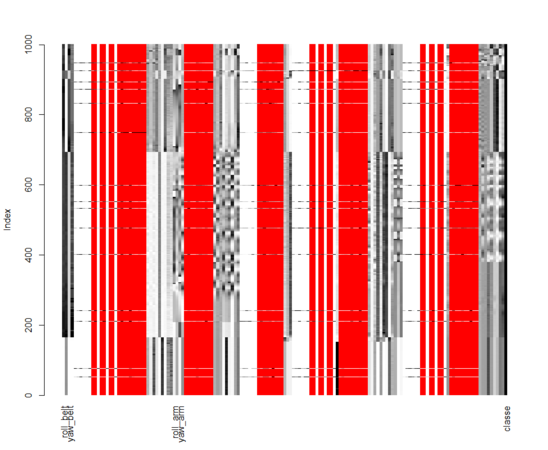

Quality of Exercise Movements
========================================================

## V. Rajaraman

### Introduction

The 'Quantifided-Self' movement is concerned with measuring human activities every day using wearable computing gadgets. In one such study (http://groupware.les.inf.puc-rio.br/har) a group of volunteers were asked to perform dumb bell exercises and their body movements were recorded using accelerometers attached to their bodies. There are correct and incorrect ways of doing the exercise. These are classified into 5 categories, named 'A' to 'E'.

### Data
The core of the project is to predict the category of movement from the biometric data. The data set consists of 19622 rows of 159 predictor variables and a columm for the activity indicator. We will first load the data and do a quick exploratory analysis.

```{r cache=TRUE, message=FALSE}
# load necessary libraries
library(VIM)
library(corrplot)
library(caret)
```

### Exploratory analysis
Load training data set:
```{r cache=TRUE}
da = read.csv("pml-training.csv")
dim(da)
#str(da)
names(da)[1:10]
sum(complete.cases(da))
```

We see that only 460 out of the 19622 rows are complete in every respect. This indicates the presense of a large number of NAs in the data. We do some initial cleanup by removing the row ids, user names etc that will not be used in this analysis.

The matrixplot() function in VIM package is an easy way to visualize a data set. Since there are a large number of rows, we will visualize only the first 1000 rows:

```{r cache=TRUE}
# remove ids, user names, time stamps etc
da = da[-(1:7)]
dim(da)

```

NA values are indicated in red in a matrix plot. The plot below shows that a large number of colums are blank. 
```{r eval=FALSE}
matrixplot(da[1:1000,]) # takes long time
```



The algorithm used to identify the blank columns is: if a colum has more than 100 NAs, then drop the column.

```{r cache=TRUE}
# some columns are full of NAs, first identify them
nas = apply(da, 2, function(x)sum(is.na(x)))
w = which(nas > 100)
length(w)
# remove the NA columns
da = da[-w]
dim(da)
```

We also see from the matrix plot that many of the columns are mostly blank, except for a few numbers. There are also cells indicating a #DIV by 0 error. We remove these factor variables also.

```{r cache=TRUE}
fac = sapply(da, is.factor)
w = which(fac)
names(w)=NULL
length(w) 
w = w[-length(w)] # retain classe column
# remove the columns permanently
da = da[-w]
dim(da) 
```

Now we have a neat 52 variables to model with. Column #53 is the outcome label. But again, we may not need all the 19622 rows for modeling. We will pick a random sample of 5000 rows for our work:
.
```{r cache=TRUE}
# before subsetting, record the distribution of the groups
t1 = table(da$classe)
t1/sum(t1)

# take only a subset of 5000 rows for modeling
set.seed(321)
samp = sample(1:nrow(da), 5000)
da = da[samp, ]
t2 = table(da$classe)
t2/sum(t2)  # same as t1

```
We double check the accuracy of the subset by checking the class distribution before and after subsetting. The distribution tables are very nearly the same, so we can proceed.

### Data Visualization

We next find the correlations among the columns:
```{r cache=TRUE}
# find correlations among the columns
cormat = abs(cor(da[-53]))
corrplot(cormat)
```
Apart from the diagonals, there are some highly correlated columns. This may be useful later to choose columns for the model. But for now, we decide to ignore the correlations and use all the 52 explanatory variables for modeling.

Next we visualize the range and spread of values in the columns by drawing box plots:
```{r fig.width=9, fig.height=5.5}
# visualize the spread fo the variables
boxplot(da[-53], xaxt="n") 
mtext(side=1, text=1:52, at=1:52, cex=0.5)
```
There is lot of variation in the range of variables. This hints at the need for centering and scaling.

## Modeling 
### Data partition
We do a traditional 70:30 split for model evaluation.
```{r cache=TRUE}
set.seed(123)
index = createDataPartition(da$classe, p=0.7, list=F)
trainset = da[index, ]
testset = da[-index, ]
t3 = table(trainset$classe)
t3/sum(t3) 
```
Thus we have verified that the distribution of labels in the training set are nearly the same as in the original data set.

### Model fitting
We tried various models and evaluated them for performance. The details are omitted here due to space constraints. The cross validation accuracy rates were:

* Tree (rpart) : 89 %
* J.48 : 88 % 
* Multilayer Perceptron: 91 %
* Logistic Regression : 72 %
* LDA Tree: 42 %
* Random Forest:95 %

Thus we chose random forest model as the best predictor for this data set.
```{r eval=FALSE}
# fit a random forest model
fit1 = train(classe~., data=trainset, method="rf") # takes a long time
fit1
fit1$finalModel
```

```
Random Forest 

3503 samples
  52 predictors
   5 classes: 'A', 'B', 'C', 'D', 'E' 

No pre-processing
Resampling: Bootstrapped (25 reps) 

Summary of sample sizes: 3503, 3503, 3503, 3503, 3503, 3503, ... 

Resampling results across tuning parameters:

  mtry  Accuracy  Kappa  Accuracy SD  Kappa SD
  2     0.948     0.934  0.00688      0.0087  
  27    0.952     0.94   0.00676      0.00855 
  52    0.943     0.928  0.0106       0.0134 
```
### Model validation
```{r eval=FALSE}
# validate using the split test set
pr1 = predict(fit1, testset)
confusionMatrix(pr1, testset$classe)
```

```
Call:
 randomForest(x = x, y = y, mtry = param$mtry) 
               Type of random forest: classification
                     Number of trees: 500
No. of variables tried at each split: 27

        OOB estimate of  error rate: 3.48%
Confusion matrix:
    A   B   C   D   E class.error
A 976   7   2   2   2  0.01314459
B  29 642  18   1   1  0.07091172
C   0  15 567  11   2  0.04705882
D   1   2  17 572   1  0.03541315
E   0   0   6   5 624  0.01732283
```
### Error estimate and Accuracy

**The out of band error rate is estimated to be 3.48 %.**

**The accuracy of our model is 96.46 %.** 

**The kappa statistic is high at 0.9552.** 

This means all the predicions mutually agree to a high degree. The p-value indicates the null hypothesis can be rejected. 

```
Overall Statistics
                                          
               Accuracy : 0.9646          
                 95% CI : (0.9539, 0.9734)
    No Information Rate : 0.2826          
    P-Value [Acc > NIR] : < 2e-16         
                                          
                  Kappa : 0.9552          
 Mcnemar's Test P-Value : 0.02647 
```
As a final step, we load the test set provided for project evaluation, pml-testing.csv and perform the exact subsetting on columns as we did on the training set. (Details are not shown here to save space). We call it da2. Then we use our model to predict the 20 activity labels.

```{r eval=FALSE}
# use it on the actual test set to be submitted for project evaluation
pr2 = predict(fit1, da2[-53]) # remove row index
pr2
```
```
[1] B A B A A E D B A A B C B A E E A B B B
Levels: A B C D E
```
### Conclusion
We fitted a random forest model to the classification problem of human activity. When the final outcomes were uploaded to the course website, all the 20 predictions turned out to be correct.
